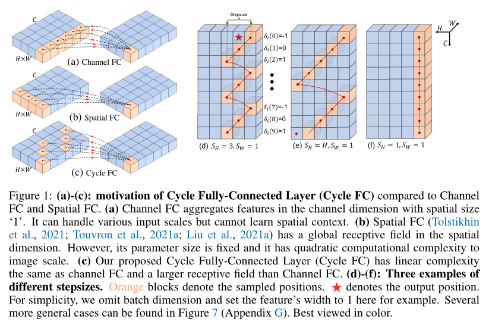

# CycleMlp_paddle
reproduction of cyclemlp by paddlepaddle

reference: [https://github.com/ShoufaChen/CycleMLP](https://github.com/ShoufaChen/CycleMLP)
papers: [https://paperswithcode.com/paper/cyclemlp-a-mlp-like-architecture-for-dense](https://paperswithcode.com/paper/cyclemlp-a-mlp-like-architecture-for-dense)

## 1、简介
  
上图（来自论文）为本文提出的Cycle FC模块，该模块具有2个优点：  
1、计算复杂度和channel FC相同；  
2、比channel FC具有更大的感受野。  

## 2、复现精度
> Light_imagenet（imagenet图片压缩处理）复现结果如下表。


|Model|optimizer|epoches|image_size|batch_size|dataset|accuracy|link|
|:---:|:---:|:---:|:---:|:---:|:---:|:---:|:---:|
|CycleMLP|AdamW|400|224x224|1024|Light_ImageNet|78.59%| [model（提取码：j3yn）](https://pan.baidu.com/s/11U4WVb_k7Mjcykw2m9cxeQ)|

训练过程说明：  
1、使用ppcls/configs/ImageNet/CycleMLP/CycleMLP_patch16_224.yaml训练300Epoches，acc为：78.27%；  
2、使用ppcls/configs/ImageNet/CycleMLP/CycleMLP_patch16_224_1.yaml加载上一步的lastest权重进行finetuning，最优acc 78.59%。    
具体过程参考[脚本任务](https://aistudio.baidu.com/aistudio/clusterprojectdetail/3435750)

## 3、数据集
数据集使用ImageNet 2012的训练数据集，有1000类，训练集图片有1281167张，验证集图片有50000张，大小为144GB，aistudio上的地址为：[https://aistudio.baidu.com/aistudio/datasetdetail/79807]([https://aistudio.baidu.com/aistudio/datasetdetail/79807)，该数据集为压缩后的数据集，复现精度会略低于原数据集。

## 4、环境
- 硬件: Tesla V100 * 4

- 框架:
    - PaddlePaddle == 2.2.1
    
## 5、快速开始
### （1）克隆项目
```bash
git clone https://github.com/justld/CycleMlp_paddle.git
```

### （2）安装第三方库
```bash
pip install -r requirements.txt
```

### （3）训练模型
单卡训练(本项目的复现环境是Tesla V100 * 4，单卡训练可能达不到本项目复现的结果)：
```bash
python tools/train.py -c ./ppcls/configs/ImageNet/CycleMLP/CycleMLP_patch16_224.yaml -o Global.device=gpu 
```
多卡训练:
```bash
python -m paddle.distributed.launch tools/train.py -c ./ppcls/configs/ImageNet/CycleMLP/CycleMLP_patch16_224.yaml -o Global.device=gpu 
```

### （4） 验证
在验证集测试(单卡)-权重链接在上方表格：
```bash
python tools/eval.py -c ./ppcls/configs/ImageNet/CycleMLP/CycleMLP_patch16_224.yaml -o Global.pretrained_model=output/stage2/weight/best_model
```

### （5） 预测
模型预测-权重链接在上方表格：
```bash
python tools/eval.py -c ./ppcls/configs/ImageNet/CycleMLP/CycleMLP_patch16_224.yaml -o Global.pretrained_model=output/stage2/weight/best_model -o Infer.infer_imgs={path to image}
```

## 6、代码结构与说明
本次复现基于[paddleclas](https://github.com/PaddlePaddle/PaddleClas) ，使用方法与paddleclas一致。   

|-images   readme使用的图片  
|-ppcls  
|--arch      网络结构，添加backbone\model_zoo\cyclemlp.py    
|--configs   配置文件，添加configs/ImageNet/CycleMLP/CycleMLP_patch16_224.yaml   
|--data       
|--engine    
|--loss      
|--metric    
|--optimizer  
|--static     
|--utils      
|--__init__.py    
|-tools       
|-log                     见下方说明    
|--stage1/trainer-0.log   第一阶段训练日志  
|--stage2/trainer-0.log   第二阶段训练日志
|--stage3/train_0.log     finetuning日志  
|-output                  权重--output文件需要从百度云下载(链接：https://pan.baidu.com/s/11U4WVb_k7Mjcykw2m9cxeQ提取码：j3yn)    
|--stage1                 第一阶段最后一个epoch的权重  
|--stage2                 第二阶段最后一个epoch的权重  
|--stage3                 finetuning最优权重
|  __init__.py      
|  paddleclas.py       
|  README.md         
|  requirements.txt    
|  setup.py       

日志说明:  
本次复现使用aistudio脚本任务，脚本任务有72小时运行限制，故训练分2阶段进行，为了加快训练速度，第一阶段的训练eval的间隔为100个epoch，第二阶段eval间隔为2epoch。
300个epoch训练完毕后，使用epoch 300的权重进行finetuning，总共训练400个epoch。
权重说明:  
stage1中保存第一阶段训练最后一个epoch的权重，stage2是第二阶段最后epoch的权重，stage3中保存finetuning的最优权重。  

## 7、模型信息

相关信息:

| 信息 | 描述 |
| --- | --- |
| 作者 | 郎督|
| 日期 | 2022年2月 |
| 框架版本 | PaddlePaddle==2.2.1 |
| 应用场景 | 图像分类 |
| 硬件支持 | GPU |
| 在线体验 | [notebook](https://aistudio.baidu.com/aistudio/projectdetail/3486584), [Script](https://aistudio.baidu.com/aistudio/clusterprojectdetail/3435750)|


